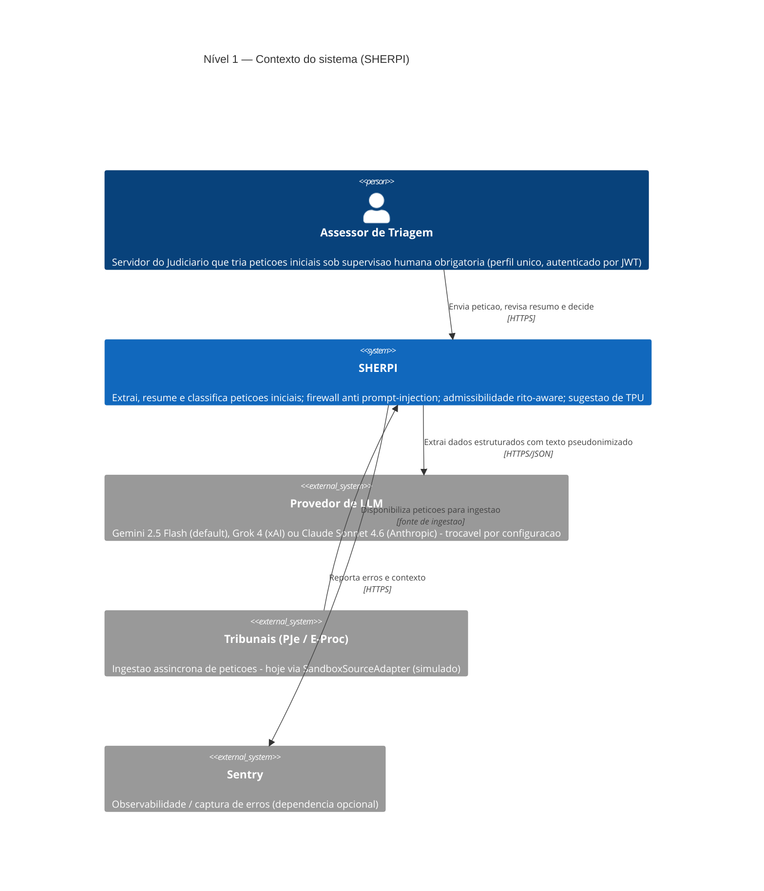
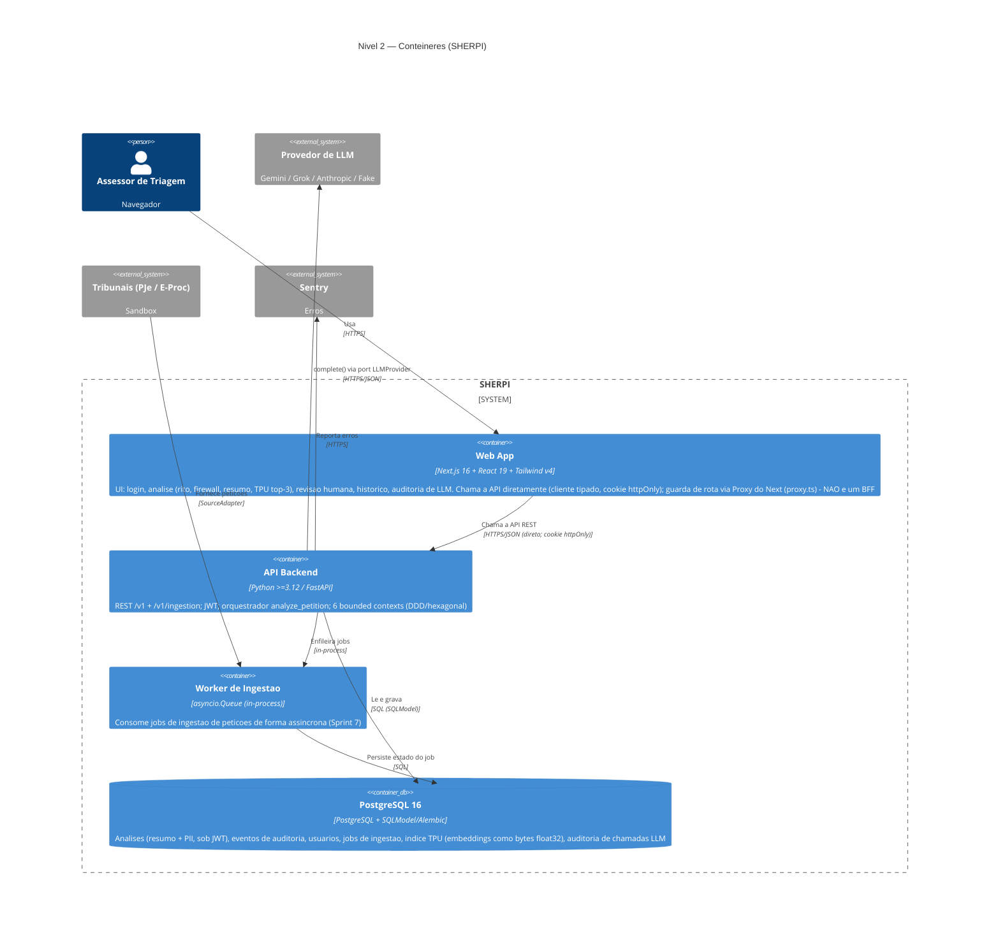
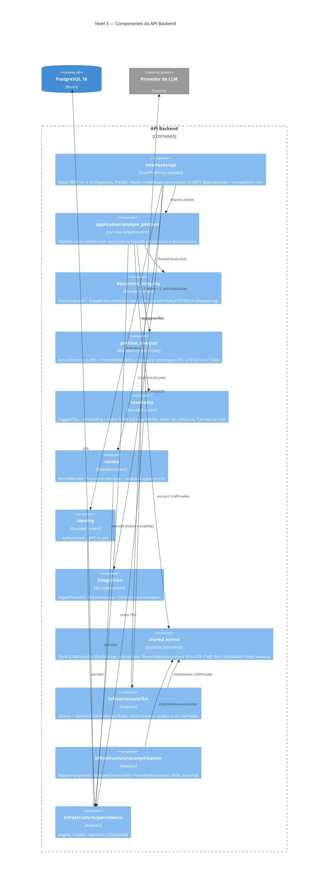
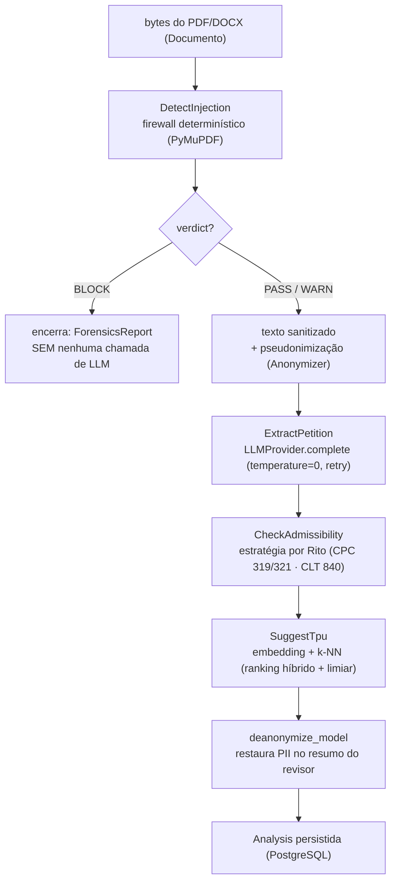

# Modelo C4 — SHERPI

Visão da arquitetura do SHERPI pelos quatro níveis do **modelo C4** (Simon Brown): do mais
abstrato (Contexto) ao mais concreto (Código). Os diagramas refletem o **estado implementado**
(Sprints 1–9), não uma visão aspiracional — em caso de divergência, vale o código.

Complementa, sem repetir:
- [`tech-spec-sherpi.md`](tech-spec-sherpi.md) — contratos das capacidades, camada LLM, API;
- [`ddd-context-map.md`](ddd-context-map.md) — relações upstream/downstream entre contextos e linguagem ubíqua;
- [`adr/`](adr/) — as decisões que justificam cada escolha.

> **Convenção de leitura.** O sistema é um **monólito modular DDD** com **ports & adapters
> (hexagonal)**: o domínio é puro e toda dependência externa (LLM, banco, parser de PDF, embeddings)
> entra por um *port* implementado como *adapter* trocável. É o que o torna **agnóstico a LLM**.

---

## Nível 1 — Contexto do sistema

Quem usa o SHERPI e com quais sistemas externos ele conversa.

**Notas de implementação**
- O **firewall** é **determinístico e sem LLM**: se o veredito for `BLOCK`, o fluxo encerra **antes**
  de qualquer chamada externa (economia de token + não alimentar o modelo com conteúdo manipulado).
- O texto que vai ao LLM externo é **pseudonimizado** (masking reversível das partes/PII — LGPD art. 5º,
  XI); os valores reais são restaurados no resumo do revisor ([ADR-0012](adr/0012-reversible-anonymization-restore.md)).
- A classificação **TPU** roda **localmente** (embedding + k-NN), sem chamada externa.

---

## Nível 2 — Contêineres

As unidades executáveis/implantáveis e os dados.

**Notas de implementação**
- O **Worker de Ingestão** é *in-process* (uma `asyncio.Queue`), não um contêiner separado — é
  apresentado à parte por ter ciclo de vida próprio (job assíncrono). Não há broker externo no MVP.
- O **modelo de embedding** do TPU (JurisBERT, ou `FakeEmbeddingModel` em testes) roda **dentro** do
  processo da API — não é um serviço à parte.
- Implantação: `docker-compose.prod.yml` sobe **Postgres + API** (imagem multi-stage, *non-root*); o
  `docker-compose.yml` de dev sobe **só o banco**.

---

## Nível 3 — Componentes (API Backend)

Decomposição interna do contêiner **API Backend**, por camada hexagonal e bounded context.

**Notas de implementação**
- A **regra do hexágono**: cada contexto tem `domain` (puro) → `application` (use cases) →
  `infrastructure` (adapters). O `shared_kernel` declara os ports transversais; os adapters em
  `infrastructure/` os implementam e são **injetados** em `interfaces/api/dependencies.py` (composition root).
- `document_integrity` é o **único** contexto que **não** depende de LLM — é puro PyMuPDF/python-docx.
- A numeração das setas do orquestrador (1→4) corresponde ao fluxo do Nível 4.

---

## Nível 4 — Código (fluxo do orquestrador `analyze_petition`)

No nível mais concreto, o C4 admite mostrar a estrutura de código onde ela for relevante. Aqui o que
importa é o **fluxo do use case** que costura os contextos — um Python explícito com **um único ponto
de bifurcação** (não um framework de grafos).

**Invariantes do fluxo**
- **`BLOCK` ⇒ zero LLM.** O *early-exit* do firewall é inegociável (custo + segurança).
- O **prompt persistido** para auditoria fica **pseudonimizado** (é o que o LLM viu); o **resumo
  persistido** contém PII e fica atrás de **JWT** (cripto em repouso = Fase 4).
- `CheckAdmissibility` é **determinístico + semântico**: validadores por rito, não só prompt.

---

## Rastreabilidade C4 ↔ código

| Nível C4 | Onde está no repositório |
|---|---|
| Contêiner Web App | `frontend/` (Next.js — `src/app`, `src/proxy.ts` = Proxy do Next 16, ex-middleware) |
| Contêiner API | `backend/src/sherpi/interfaces/api/` |
| Orquestrador | `backend/src/sherpi/application/analyze_petition.py` |
| Bounded contexts | `backend/src/sherpi/contexts/<contexto>/{domain,application,infrastructure}/` |
| Ports transversais | `backend/src/sherpi/shared_kernel/ports.py`, `value_objects.py` |
| Adapters de infraestrutura | `backend/src/sherpi/infrastructure/{llm,anonymization,persistence}/` |
| Composition root (DI) | `backend/src/sherpi/interfaces/api/dependencies.py` |
