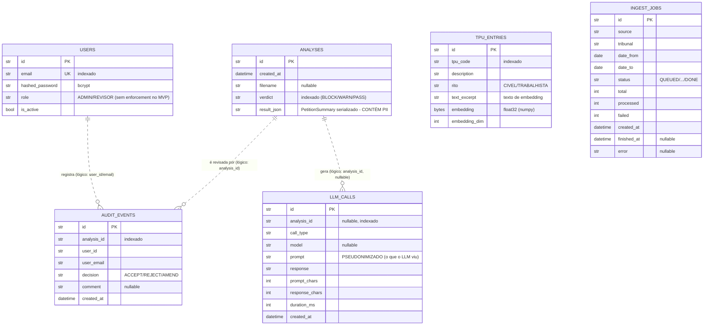

# Modelo de Dados — SHERPI

Esquema relacional **fiel à implementação** (`backend/src/sherpi/infrastructure/persistence/models.py`;
migrations em `backend/alembic/`). Reflete o estado atual (Sprints 1–9). Para o contexto arquitetural
das tabelas, ver o [modelo C4](c4-model.md); para privacidade, o [RIPD/DPIA](dpia.md).

> **Decisão de modelagem (fiel ao código):** os vínculos entre tabelas são **lógicos (soft links)**,
> **sem chaves estrangeiras rígidas** no banco. Motivo: registros são gravados em momentos diferentes
> do pipeline (ex.: `llm_calls` é persistido **durante** a análise, antes do registro de `analyses`).
> A integridade referencial é garantida na aplicação, não por `FOREIGN KEY`.

---

## 1. Diagrama entidade-relacionamento

`TPU_ENTRIES` e `INGEST_JOBS` não têm relacionamento com as demais — são, respectivamente, o **índice
da classificação TPU** e a **fila de ingestão** (estado dos jobs assíncronos).

---

## 2. Dicionário de dados

### 2.1 `analyses` — análises persistidas
Resultado consolidado de uma análise (resumo, laudo do firewall, sugestões TPU).

| Coluna | Tipo | Restrições | Descrição |
|---|---|---|---|
| `id` | str | PK | Identificador da análise. |
| `created_at` | datetime | — | Momento da criação. |
| `filename` | str? | nullable | Nome do arquivo enviado. |
| `verdict` | str | index | Verdito do firewall (`BLOCK`/`WARN`/`PASS`). |
| `result_json` | str | — | `PetitionSummary`/laudo serializado em JSON. **⚠️ contém PII** (restaurada — ver [ADR-0012](adr/0012-reversible-anonymization-restore.md)); acesso por JWT; cripto em repouso = Fase 4. |

### 2.2 `users` — usuários
Credenciais e papel do assessor autenticado.

| Coluna | Tipo | Restrições | Descrição |
|---|---|---|---|
| `id` | str | PK | Identificador do usuário. |
| `email` | str | unique, index | Login. |
| `hashed_password` | str | — | Hash **bcrypt** (nunca em claro). |
| `role` | str | — | `ADMIN`/`REVISOR`. Embutido no JWT; **sem enforcement** de RBAC no MVP ([ADR-0007](adr/0007-auth-jwt-single-profile.md)). |
| `is_active` | bool | default true | Conta ativa. |

### 2.3 `audit_events` — trilha de auditoria (append-only)
Registro imutável das revisões humanas (valor legal — CNJ 615/2025).

| Coluna | Tipo | Restrições | Descrição |
|---|---|---|---|
| `id` | str | PK | Identificador do evento. |
| `analysis_id` | str | index | Análise revisada (vínculo lógico). |
| `user_id` | str | — | Autor da revisão. |
| `user_email` | str | — | E-mail do autor (desnormalizado para auditoria). |
| `decision` | str | — | `ACCEPT`/`REJECT`/`AMEND` (UI exibe rótulos PT). |
| `comment` | str? | nullable | Justificativa opcional. |
| `created_at` | datetime | — | Momento da decisão. |

> **Append-only**: gravado a cada `POST /v1/analyses/{id}/review`; nunca atualizado/removido (ver [threat-model.md](threat-model.md) T5).

### 2.4 `llm_calls` — auditoria de chamadas ao LLM
Prompt + resposta de cada chamada ao modelo, para transparência do que foi enviado.

| Coluna | Tipo | Restrições | Descrição |
|---|---|---|---|
| `id` | str | PK | Identificador da chamada. |
| `analysis_id` | str? | nullable, index | Análise associada (gravado antes do registro da análise → nullable). |
| `call_type` | str | — | Tipo da chamada (ex.: extração). |
| `model` | str? | nullable | Modelo usado (ex.: `gemini-2.5-flash`). |
| `prompt` | str | — | **Pseudonimizado** — é exatamente o que o LLM externo recebeu (LGPD). |
| `response` | str | — | Resposta do modelo. |
| `prompt_chars` | int | — | Tamanho do prompt. |
| `response_chars` | int | — | Tamanho da resposta. |
| `duration_ms` | int | — | Latência da chamada. |
| `created_at` | datetime | — | Momento da chamada. |

### 2.5 `tpu_entries` — índice da classificação TPU
Catálogo da TUA/CNJ com embeddings para busca k-NN ([ADR-0016](adr/0016-cnj-tua-real-catalog-tpu.md), [ADR-0009](adr/0009-knn-numpy-bytes.md)).

| Coluna | Tipo | Restrições | Descrição |
|---|---|---|---|
| `id` | str | PK | Identificador da entrada (ex.: `cnj-<cod_item>`). |
| `tpu_code` | str | index | Código do assunto na TPU/CNJ. |
| `description` | str | — | Nome do assunto. |
| `rito` | str | — | `CIVEL`/`TRABALHISTA`. |
| `text_excerpt` | str | — | Texto usado para gerar o embedding (caminho + glossário). |
| `embedding` | bytes | — | Vetor `float32` serializado (numpy) — sem extensão pgvector. |
| `embedding_dim` | int | — | Dimensão do vetor (ex.: 768 JurisBERT / 64 Fake). |

### 2.6 `ingest_jobs` — fila de ingestão assíncrona
Estado dos jobs de ingestão de petições (PJe/E-Proc/sandbox — Sprint 7).

| Coluna | Tipo | Restrições | Descrição |
|---|---|---|---|
| `id` | str | PK | Identificador do job. |
| `source` | str | — | Fonte (ex.: sandbox). |
| `tribunal` | str | — | Tribunal-alvo. |
| `date_from` / `date_to` | date | — | Janela de busca. |
| `status` | str | default `QUEUED` | Estado do job (`QUEUED` → … → `DONE`). |
| `total` / `processed` / `failed` | int | default 0 | Contadores de progresso. |
| `created_at` | datetime | — | Criação. |
| `finished_at` | datetime? | nullable | Conclusão. |
| `error` | str? | nullable | Mensagem de erro, se falhou. |

---

## 3. Notas de PII/LGPD

| Tabela | PII? | Tratamento |
|---|---|---|
| `analyses.result_json` | **Sim** (restaurada) | JWT; retenção (`retention_days`); cripto em repouso = Fase 4 |
| `llm_calls.prompt` | **Pseudonimizado** | É o texto que foi ao LLM externo (placeholders) |
| `users` | Login + hash | Senha só em hash bcrypt |
| `audit_events` | E-mail do revisor | Necessário para a trilha legal |
| `tpu_entries`, `ingest_jobs` | Não | Catálogo público / metadados de job |

Detalhes e riscos em [dpia.md](dpia.md) e [security.md](security.md). O esquema é gerado/migrado por
**Alembic**; este documento deve ser revisto a cada migration que altere tabelas.

> **Reprodução:** a estrutura acima deriva de `infrastructure/persistence/models.py`. O contrato da API
> que expõe esses dados está versionado em [`openapi.json`](openapi.json) (`make openapi`).
