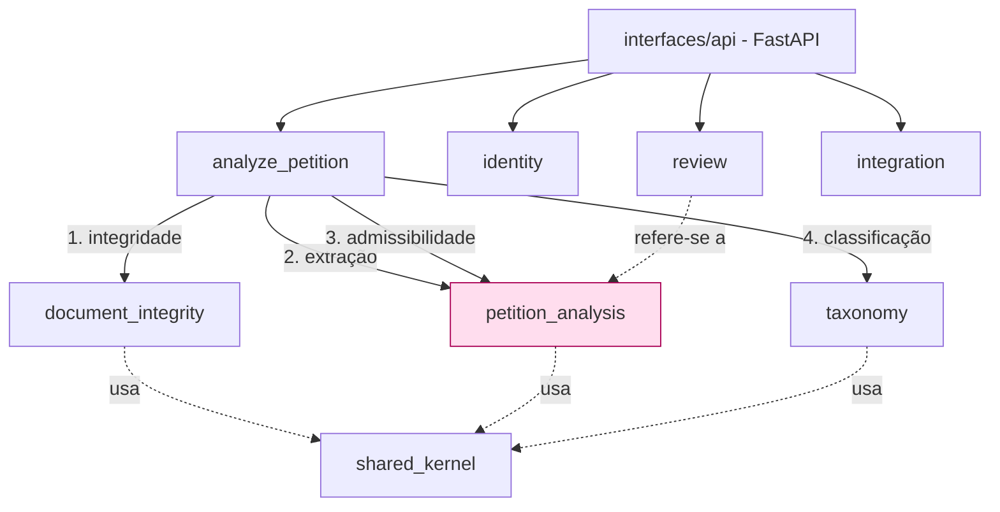

# Mapa de Contextos (DDD) e Linguagem Ubíqua — SHERPI

| Campo | Valor |
|---|---|
| Documento | Context Map + Glossário |
| Versão | 1.3 |
| Status | Aprovado |
| Última atualização | 2026-06-20 |

---

## 1. Bounded contexts

| Contexto | Tipo | Responsabilidade |
|---|---|---|
| **document_integrity** | Supporting (diferencial do produto) | Firewall anti prompt-injection. Inspeciona o PDF (PyMuPDF, sem LLM) e emite `ForensicsReport` com verdito `BLOCK/WARN/PASS`. |
| **petition_analysis** | **Core domain** | Extração estruturada (`PetitionSummary`) e checagem de admissibilidade **rito-aware** (`AdmissibilityReport`): `CheckAdmissibility` despacha por `Rito` para uma `AdmissibilityStrategy` — `CivelStrategy` (CPC 319/321) ou `TrabalhistaStrategy` (CLT 840 §1º). Razão de existir do sistema. |
| **taxonomy** | Supporting subdomain | Classificação TPU: embedding (JurisBERT) + k-NN sobre seed → top-3 `TpuSuggestion`. |
| **review** | Supporting | Human-in-the-loop e auditoria append-only (Res. CNJ 615/2025): `ReviewDecision`, `AuditEvent`. |
| **identity** | Supporting | Autenticação (perfil único, extensível a RBAC): `User`, `Role`, `BcryptHasher`, `JwtIssuer`, OAuth2/JWT. |
| **integration** | Supporting | Ingestão processual: `PetitionSource` port; `SandboxSourceAdapter`; `IngestPetitions`; `IngestQueue` (asyncio). Enfileira petições de sistemas externos (PJe/E-Proc/sandbox) para análise assíncrona. |
| **shared_kernel** | Kernel compartilhado | VOs e ports usados por mais de um contexto (CPF, CNPJ, ValorCausa, RiskVerdict, Documento, Rito, Role; LLMProvider, BlobStorage, Anonymizer). |

> O `document_integrity` é o **diferencial** do produto, mas tecnicamente é supporting: o **core** é `petition_analysis`, pois é onde mora o juízo de admissibilidade e o resumo estruturado — a razão de ser do SHERPI.

---

## 2. Relações entre contextos

O use case `analyze_petition` (camada `application/`, cross-context) é o **orquestrador** que invoca os contextos em sequência. As relações são upstream→downstream a partir dele.

| Relação | Upstream | Downstream | Padrão |
|---|---|---|---|
| `analyze_petition` → `document_integrity` | orquestrador | firewall | chamada direta; early-exit se `BLOCK` |
| `analyze_petition` → `petition_analysis` | orquestrador | core | só executa se não-`BLOCK` |
| `analyze_petition` → `taxonomy` | orquestrador | TPU | recebe texto sanitizado |
| `interfaces/api` → `identity` | API | auth | gate JWT nas rotas protegidas |
| `interfaces/api` → `review` | API | auditoria | grava decisão humana vinculada ao `User` |
| `interfaces/api` → `integration` | API | ingestão | enfileira `IngestJob` via `IngestQueue` (asyncio) |
| `review` → `petition_analysis` | review | core | `AuditEvent` referencia a `Analysis` |
| `integration` → `petition_analysis` | integração | core | `IngestPetitions` aciona `AnalyzePetition` por cada `PetitionDoc` |
| todos → `shared_kernel` | — | — | kernel compartilhado (VOs e ports) |

Toda dependência externa (LLM, banco, PDF parser, embeddings, storage) é um **port** definido no contexto e um **adapter** na infraestrutura — nenhum contexto de domínio depende de framework.

---

## 3. Glossário da linguagem ubíqua

### Termos jurídicos

| Termo | Definição |
|---|---|
| **Petição inicial** | Peça que dá início ao processo (exordial/vestibular); deve atender aos requisitos do art. 319 do CPC. |
| **Admissibilidade** | Juízo prévio sobre se a petição preenche os requisitos legais para ser processada. |
| **Emenda à inicial** | Correção da petição determinada pelo juiz (art. 321 do CPC), em prazo de 15 dias, quando há vício sanável; descumprimento pode levar ao indeferimento (art. 330). |
| **Tutela de urgência / liminar** | Provimento antecipado para evitar perecimento de direito; sua presença exige priorização. No SHERPI, sinalizada com destaque. |
| **Valor da causa** | Expressão econômica do pedido; requisito do art. 319; validado quanto à presença e razoabilidade. |
| **Segredo de justiça** | Restrição de acesso a autos por sigilo legal; motiva o uso de dados sintéticos no MVP. |
| **Litigância de má-fé** | Conduta processual desleal punível (arts. 5º, 77, 80 do CPC); base para sanção em casos de prompt injection. |
| **Litigância predatória** | Ajuizamento massivo e abusivo de ações sem lastro fático (sham litigation). Fora do escopo do MVP. |
| **TPU (Tabelas Processuais Unificadas)** | Padrão nacional do CNJ (Res. 46/2007, alt. 326/2020) para classificar classe, assunto e movimentação processual em 6 níveis hierárquicos. |
| **CPF / CNPJ** | Identificadores fiscais de pessoa física/jurídica; validados por checksum (`validate-docbr`). |
| **Art. 319 do CPC** | Requisitos da petição inicial (partes, fatos, fundamentos, pedido, valor da causa). |
| **Art. 321 do CPC** | Determinação de emenda da inicial quando há defeito sanável. |
| **Resolução CNJ 615/2025** | Norma que exige supervisão humana criteriosa sobre resultados de IA no Judiciário. |
| **Rito processual** | Procedimento que rege o processo conforme a matéria (cível, trabalhista, …); no SHERPI, seleciona a estratégia de admissibilidade (`Rito` → `AdmissibilityStrategy`). |
| **Pedido líquido** | Pedido com valor certo e determinado. No rito trabalhista (CLT art. 840 §1º), cada pedido deve ser líquido; pedido ilíquido enseja emenda. |
| **Art. 840 §1º da CLT** | Exige que a reclamação trabalhista contenha pedido **certo, determinado e com indicação do valor** (pedido líquido). |

### Termos técnicos

| Termo | Definição |
|---|---|
| **Prompt injection** | Inserção de comandos ocultos no PDF para manipular a inferência de um LLM (ex.: branco-no-branco, U+200B, OCG oculto, /ActualText). |
| **Firewall (anti prompt-injection)** | Controle determinístico que inspeciona o PDF e bloqueia/alerta antes de qualquer envio ao LLM. Núcleo de segurança do produto. |
| **ForensicsReport / Anomaly** | Laudo forense do PDF e cada anomalia detectada (vetor, severidade, localização). Inclui `image_only_pages` (páginas sem camada de texto). |
| **Verdict (RiskVerdict)** | Resultado gradual do firewall: `BLOCK` (encerra sem LLM), `WARN`, `PASS`. |
| **PetitionSummary** | Resumo estruturado extraído pela IA (partes, fato gerador, fundamentação, pedidos, liminar, valor da causa). |
| **AdmissibilityReport** | Checklist de admissibilidade com semáforo (verde/amarelo/vermelho). |
| **AdmissibilityStrategy** | Estratégia de admissibilidade por rito (Protocol de domínio, `petition_analysis/domain/strategies.py`): `CivelStrategy`, `TrabalhistaStrategy`; registro `DEFAULT_STRATEGIES` (ADR-0008). |
| **TpuSuggestion** | Sugestão de código TPU com grau de confiança (top-3). |
| **Bounded context** | Fronteira de modelo no DDD; cada "skill" do SHERPI é uma capacidade de um contexto. |
| **Port / Adapter** | Interface no domínio (port) e sua implementação na infraestrutura (adapter); base do design hexagonal e do LLM-agnóstico. |
| **LLMProvider** | Port que abstrai o modelo de linguagem. Adapters: **Gemini** (default, SDK google-genai), **Grok (xAI)** e **Anthropic (Sonnet)** — estes via httpx sobre a base `HttpLLMProvider` — e `FakeProvider` (testes). |
| **HttpLLMProvider** | Base comum dos adapters de LLM sobre HTTP (httpx): guarda de custo, timeout e retry com backoff; cada provider implementa só a montagem do payload/parsing. |
| **Decorators de LLM** | Encadeados sobre o provider real: `CircuitBreakerLLMProvider` → `PersistingLLMProvider` (persiste prompt anonimizado + resposta p/ auditoria) → `LoggingLLMProvider`. |
| **Anonymizer** | Port que mascara PII antes do envio ao LLM externo (LGPD): identificadores estruturados (CPF/CNPJ/e-mail/telefone/CEP) via `RegexAnonymizer` + nomes das partes via `RegexNameAnonymizer`, compostos em `CompositeAnonymizer`. |
| **RegexNameAnonymizer** | Mascara nomes das partes por âncora (qualificação / "em face de"), inclusive listas (litisconsórcio) → `[NOME]`. Best-effort, sem dependências (ver [ADR-0010](adr/0010-name-masking-regex-vs-ner.md)). |
| **MappedRegexAnonymizer** | Anonimizador reversível com placeholders numerados (`[CPF_1]`); retorna mapa texto→placeholder para reconstituição posterior. |
| **PresidioAnonymizer** | Adapter opcional (extra `ner`; lazy import) para NER de nomes com Presidio + spaCy (cobertura completa — Fase 4). |
| **image_only_pages / image_heavy_pages** | Sinais do `ForensicsReport`: `image_only_pages` = páginas sem camada de texto (imagem/escaneado → extração pulada); `image_heavy_pages` = páginas **mistas** (têm texto, mas imagem domina → extrai e avisa). Ambos requerem OCR (Fase 4). |
| **Synthetic-first** | Estratégia de usar petições sintéticas para evitar PII real e prover ground truth. |
| **Human-in-the-loop** | Princípio inegociável: a IA sugere, o humano decide; nunca decisão automática. |
| **JurisBERT** | Modelo de embeddings jurídicos em português usado na classificação TPU (extra `ml`). |
| **k-NN** | Classificação por vizinhos mais próximos sobre embeddings (numpy/bytes, compatível SQLite+Postgres). |
| **BcryptHasher / JwtIssuer** | Implementações de hashing de senha (bcrypt direto, sem passlib) e emissão/verificação de JWT (pyjwt) no contexto `identity`. |
| **Role** | `StrEnum` do `identity`: `ADMIN`, `REVISOR`; base do RBAC. |
| **AuditEvent** | Registro imutável append-only de uma decisão de revisão humana: quem (`User`), quando, qual `ReviewDecision` (`ACEITAR/REJEITAR/CORRIGIR`). |
| **IngestJob / IngestQueue** | `IngestJob`: entidade de acompanhamento de uma tarefa de ingestão (`QUEUED/RUNNING/DONE/FAILED`). `IngestQueue`: fila asyncio que processa jobs em background (worker iniciado no lifespan FastAPI). |
| **PetitionSource** | Port (Protocol async) que representa um sistema externo de petições (`fetch(job) → AsyncIterator[PetitionDoc]`). |
