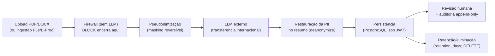

# RIPD/DPIA — Relatório de Impacto à Proteção de Dados (SHERPI)

> **Não é parecer jurídico.** Documento de engenharia de privacidade (*privacy by design*), redigido
> com apoio de IA, para organizar e demonstrar a análise de risco do tratamento de dados pessoais.
> Os itens marcados **⚠️ confirmar** dependem de validação de um(a) advogado(a)/Encarregado(a) (DPO).
> Base: **LGPD (Lei 13.709/2018)**, art. **38** (RIPD) e orientações da **ANPD**. Complementa
> [`security.md`](security.md) (controles) e [`threat-model.md`](threat-model.md) (ameaças STRIDE);
> a terminologia LGPD segue o skill `lgpd-compliance` e o [glossário](legal-glossary.md).

| Campo | Valor |
|---|---|
| Documento | Relatório de Impacto à Proteção de Dados (RIPD/DPIA) |
| Versão | 1.0 |
| Status | Rascunho (pendente de validação por DPO/jurídico) |
| Última atualização | 2026-06-22 |
| Escopo | MVP acadêmico (Sprints 1–9); marcos de produção sinalizados como **Fase 4** |

---

## 1. Por que um RIPD

A LGPD (art. 38) faculta à ANPD exigir do controlador um **relatório de impacto** quando o tratamento
puder gerar **risco às liberdades civis e aos direitos fundamentais**. O SHERPI reúne os gatilhos
clássicos para conduzi-lo *voluntariamente*, como boa prática:

- trata **dados pessoais** de partes processuais (e potencialmente **sensíveis** — saúde no
  previdenciário, dados de crianças no família);
- emprega **decisão apoiada por IA** sobre matéria com efeito jurídico (triagem/admissibilidade);
- realiza **transferência internacional** ao enviar texto a provedores de LLM no exterior;
- atua em domínio com **assimetria de poder** (cidadão × Judiciário) e expectativa de sigilo.

> **Decisão de projeto:** no MVP o risco é controlado primariamente por **synthetic-first** (não se
> tratam dados reais). Este RIPD avalia tanto o estado MVP quanto o que muda **se/quando** dados reais
> entrarem (Fase 4) — é nesse ponto que as mitigações de Fase 4 deixam de ser opcionais.

---

## 2. Partes e papéis (LGPD art. 5º, VI–IX)

| Papel | Quem | Observação |
|---|---|---|
| **Controlador** | A instituição que adotar o SHERPI em produção (ex.: tribunal/serventia) | No MVP acadêmico não há controlador operando dados reais. ⚠️ definir na adoção. |
| **Operador** | Eventual provedor de hospedagem; **provedores de LLM** atuam como suboperadores | Exige contrato/cláusulas de tratamento (art. 39). ⚠️ confirmar. |
| **Encarregado (DPO)** | A designar | Canal de atendimento ao titular (art. 41). ⚠️ designar na adoção. |
| **Titulares** | Partes do processo (autor/réu), terceiros citados, e o **usuário-assessor** (credenciais) | — |

---

## 3. Descrição do tratamento (natureza, escopo, contexto, finalidade)

**Finalidade.** Apoiar a **triagem de petições iniciais** sob **supervisão humana obrigatória**
(*human-in-the-loop*): firewall anti *prompt-injection*, extração/resumo estruturado, checagem de
admissibilidade rito-aware e sugestão de classificação TPU.

**Fluxo de dados (ciclo de vida).**

**Pontos de tratamento e o que trafega:**
- **Ingestão**: bytes do documento (não confiável) → firewall determinístico **antes** de qualquer LLM;
  `BLOCK` encerra sem enviar nada ao modelo.
- **Pré-LLM**: masking de PII estruturada (CPF/CNPJ/e-mail/telefone/CEP), ancorada (RG/CNH, benefício
  INSS, banco, B.O.) e **nomes das partes** (best-effort) → placeholders `[CPF_1]`/`[NOME_1]`.
- **LLM externo**: recebe **apenas** o texto pseudonimizado (config `anonymize_before_llm`, default on).
- **Pós-LLM**: o resumo do revisor é **restaurado** com os valores reais (`deanonymize_model`).
- **Persistência**: o **resumo persistido contém PII** (acesso por JWT); o **prompt auditado permanece
  pseudonimizado**; **logs sem PII**.
- **Eliminação**: `retention_days` (default 90) marca análises elegíveis; `DELETE /analyses` apaga.

---

## 4. Categorias de dados e titulares

| Categoria | Exemplos | Sensível? (art. 5º, II) |
|---|---|---|
| Identificadores | CPF, CNPJ, RG/CNH, nº benefício INSS, dados bancários, B.O. | Não, mas alto risco |
| Identificação direta | Nomes das partes, endereços, e-mail, telefone | Não |
| Conteúdo processual | Fatos, fundamentos, pedidos | **Pode conter sensível** (saúde, etc.) |
| Credenciais | Senha (bcrypt), JWT do assessor | Não (segredo de acesso) |
| Trilha de auditoria | `AuditEvent` (quem revisou, quando, decisão) | Não (mas íntegro/legal) |

⚠️ **Dado sensível**: previdenciário (saúde) e família (crianças, art. 14) exigem base legal mais
estrita (art. 11/14) e cautela redobrada — **fora do escopo do MVP**, sinalizado para os domínios futuros.

---

## 5. Bases legais e princípios

- **Base legal (art. 7º/11)**: a definir pelo controlador na adoção — provavelmente **execução de
  políticas públicas** (art. 7º, III) e/ou **exercício regular de direitos em processo** (art. 7º, VI).
  ⚠️ confirmar com jurídico; sensível exige hipótese do art. 11.
- **Necessidade/minimização (art. 6º, III)**: só trafega ao LLM o texto necessário, **pseudonimizado**;
  validações determinísticas (CPF/CNPJ) rodam sobre o original sem expô-lo ao modelo.
- **Finalidade/adequação (art. 6º, I–II)**: uso restrito à triagem; **sem decisão automatizada**.
- **Transparência/prestação de contas (art. 6º, VI e X)**: auditoria append-only de revisões **e** das
  chamadas ao LLM (prompt pseudonimizado + resposta), consultável na UI.

---

## 6. Transferência internacional (LGPD art. 33)

O envio de texto a **Gemini (Google)**, **Grok (xAI)** ou **Claude (Anthropic)** — todos com
infraestrutura **fora do Brasil** — caracteriza **transferência internacional de dados**. No MVP isso é
mitigado por **synthetic-first** (não há dado real) e **pseudonimização**. Em produção com dados reais:

- exige fundamento do art. 33 (cláusulas-padrão, adequação, ou consentimento específico) — ⚠️ confirmar;
- a **opção de LLM local/on-prem** (Ollama) na Fase 4 **elimina** a transferência para dados sensíveis;
- a arquitetura **agnóstica a LLM** (port `LLMProvider`) já torna essa troca uma decisão de configuração.

---

## 7. Avaliação de riscos aos titulares

Escala: probabilidade × impacto ∈ {Baixo, Médio, Alto}. Os riscos espelham o `threat-model.md`, mas
sob a ótica do **titular** (não do sistema).

| # | Risco ao titular | Prob. (MVP) | Impacto | Mitigação principal | Risco residual |
|---|---|---|---|---|---|
| **R1** | Exposição de PII ao LLM externo / transferência internacional | Baixa¹ | Alto | Synthetic-first; pseudonimização pré-LLM; logs sem PII | **Baixo** (MVP) / **Médio** (dados reais, até NER+LLM local) |
| **R2** | Vazamento de nome citado **livremente nos fatos** (masking é best-effort) | Média | Médio | Masking por âncora; agrupamento por bloco; eval | **Médio** → NER (Presidio) na Fase 4 |
| **R3** | Acesso indevido ao resumo persistido (contém PII restaurada) | Baixa | Alto | JWT; sem PII em log | **Médio** → criptografia em repouso (Fase 4) |
| **R4** | Manipulação da análise por *prompt injection* afetando o titular | Baixa | Alto | Firewall determinístico + *defensive prompting*; `BLOCK` sem LLM | **Baixo** (heurístico → eval por vetor) |
| **R5** | Decisão injusta/erro de IA sem revisão | Baixa | Alto | **Human-in-the-loop obrigatório**; auditoria append-only | **Baixo** |
| **R6** | Retenção excessiva / direito ao esquecimento não atendido | Média | Médio | `retention_days` + `DELETE /analyses` | **Médio** → agendamento de expurgo (Fase 4) |
| **R7** | Tratamento de **dado sensível** sem base estrita (prev./família) | N/A (fora do escopo) | Alto | Domínios não habilitados no MVP | **Aceito** (escopo) — reabrir ao habilitar |
| **R8** | Reidentificação a partir de dado pseudonimizado | Baixa | Médio | Mapa de reversão mantido **em separado**, acesso controlado | **Baixo** |

¹ No MVP, *synthetic-first* torna a probabilidade de PII **real** vazar próxima de nula; a coluna
assume o uso pretendido (dados sintéticos). Com dados reais, R1 sobe para **Média** até as mitigações de Fase 4.

---

## 8. Direitos dos titulares (art. 18) e como atendê-los

| Direito | Atendimento atual | Lacuna / Fase 4 |
|---|---|---|
| Confirmação/acesso | Resumo e auditoria consultáveis (sob JWT) | Canal formal ao titular via DPO ⚠️ |
| Correção | Revisão humana corrige o resumo (decisão AMEND) | — |
| Eliminação/esquecimento | `DELETE /analyses` + `retention_days` | Expurgo agendado + comprovação |
| Portabilidade/informação | Estrutura exportável (OpenAPI) | Procedimento formal ⚠️ |
| Revisão de decisão automatizada (art. 20) | **Não há decisão automatizada** — humano decide | Registrar essa garantia na política |

---

## 9. Risco residual e parecer

- **No MVP (synthetic-first):** risco **Baixo** e **aceitável** — não há tratamento de dados pessoais
  reais; as mitigações em vigor (firewall, pseudonimização, JWT, auditoria, human-in-the-loop) já
  reduzem materialmente os vetores caso dados reais transitem por engano.
- **Para produção com dados reais:** o risco passa a **Médio** e **só é aceitável** após implementar os
  itens de **Fase 4** que este RIPD eleva de "opcional" a **condição**: (a) criptografia em repouso do
  resumo; (b) NER de nomes (cobertura de texto livre); (c) expurgo agendado; (d) fundamento de
  transferência internacional **ou** LLM local para dados sensíveis; (e) base legal validada e DPO designado.

**Conclusão.** O tratamento é **proporcional e necessário** à finalidade, com riscos endereçados por
*privacy by design*. As decisões de risco aceitas estão registradas (§7, R7 e `threat-model.md` §4).
Reavaliar este RIPD a cada: novo domínio (esp. sensível), troca de provedor de LLM, ou entrada de
dados reais. ⚠️ **Validação final pendente de DPO/jurídico.**

---

## Apêndice — rastreabilidade

| Tema | Onde no código/docs |
|---|---|
| Pseudonimização reversível | `infrastructure/anonymization/`, [ADR-0012](adr/0012-reversible-anonymization-restore.md), [ADR-0010](adr/0010-name-masking-regex-vs-ner.md) |
| Firewall (R4) | `contexts/document_integrity/`, [threat-model.md](threat-model.md) T1 |
| Human-in-the-loop / auditoria (R5) | `contexts/review/`, [security.md](security.md) §5 |
| Retenção/eliminação (R6) | `config.py` (`retention_days`), `DELETE /analyses` |
| Transferência internacional (§6) | `infrastructure/llm/` (port agnóstico), [ADR-0003](adr/0003-llm-agnostic-via-port.md) |
| Controles por fase | [security.md](security.md) §7 |
