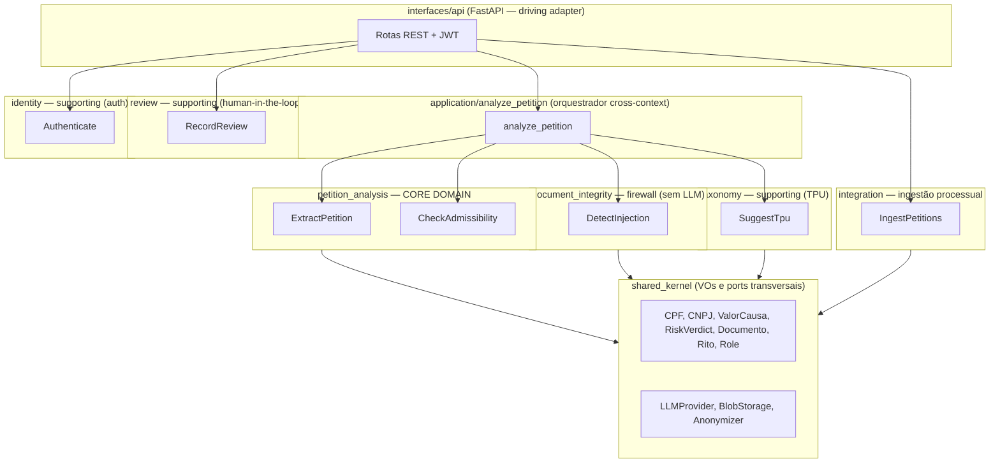
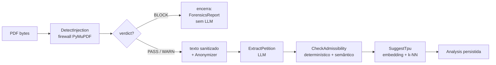
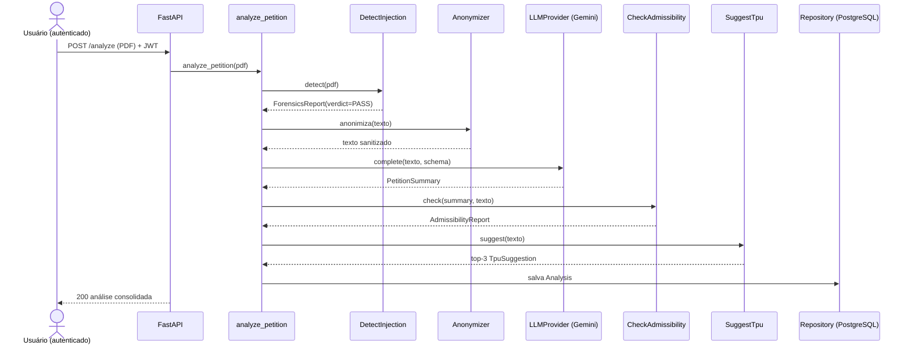
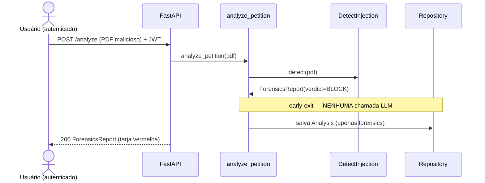

# Especificação Técnica — SHERPI

| Campo | Valor |
|---|---|
| Documento | Especificação Técnica |
| Versão | 1.4 |
| Status | Aprovado para MVP |
| Última atualização | 2026-06-20 |

---

## 1. Visão de arquitetura

O SHERPI é um **monólito modular orientado a DDD** com **ports & adapters (arquitetura hexagonal)**. O código é organizado por **bounded context**, cada um com camadas `domain` → `application` → `infrastructure`. O **domínio é puro**: não importa FastAPI, SQL, PyMuPDF nem SDK de LLM. Toda dependência externa (LLM, banco, parser de PDF, embeddings, storage) é declarada como um **port** na camada interna e implementada como um **adapter** na infraestrutura. É assim que o sistema cumpre o requisito de ser **LLM-agnóstico**.

Cada "skill" do requisito original vira uma **capacidade de um bounded context**, exposta como **domain service** (regra pura) ou **application use case** (orquestração), atrás de um port.

### 1.1 Bounded contexts



### 1.2 Fluxo do orquestrador `analyze_petition`

O orquestrador é um **use case Python explícito** (uma função com um `if` de *early-exit*), não um framework de grafos. O fluxo é linear com um único ponto de bifurcação.



Regra inegociável: **se o firewall retornar `BLOCK`, o fluxo encerra sem nenhuma chamada de LLM** (economia de tokens + não alimentar o modelo com conteúdo manipulado).

> **Arquitetura completa (Sprints 1–9).** O MVP (Sprints 1–2) entregou o caminho **firewall → extração → admissibilidade**; a Fase 4 (Sprints 3–9) adicionou rito-aware (S3), `identity`/`review` (S4), `taxonomy` TPU (S5), observabilidade/LGPD/deploy (S6), `integration` PJe/E-Proc (S7), UI completa — login, rito, TPU, revisão (S8) e refactor en-US/compliance (S9).

---

## 2. Contratos das capacidades (entrada/saída)

Os contratos são expressos como Value Objects (Pydantic) nas camadas de domínio. Os tipos abaixo são especificação, não código de implementação.

### 2.1 Document Integrity — `DetectInjection` (firewall, sem LLM)

- **Entrada**: bytes do PDF (`Documento`).
- **Saída**: `ForensicsReport`.

| VO | Campos | Descrição |
|---|---|---|
| `ForensicsReport` | `anomalies: list[Anomaly]`, `risk_score: float`, `verdict: RiskVerdict`, `image_only_pages: list[int]` | Laudo forense; `image_only_pages` marca páginas sem camada de texto (imagem/escaneado — extração não confiável, requer OCR). |
| `Anomaly` | `vector: str`, `severity`, `location` (página/coordenadas), `evidence` | Uma ocorrência de vetor de injeção. |
| `RiskVerdict` | `BLOCK \| WARN \| PASS` | Verdito gradual derivado do `risk_score`. |

Determinístico, via **PyMuPDF**, fortemente unit-testado. É o **núcleo do produto**.

### 2.2 Petition Analysis — `ExtractPetition`

- **Entrada**: texto sanitizado (e anonimizado, se a flag estiver ativa).
- **Saída**: `PetitionSummary`.

| VO | Campos |
|---|---|
| `PetitionSummary` | `partes: list[Parte]`, `fato_gerador: str`, `fundamentacao: str`, `pedidos: list[Pedido]`, `tem_liminar: bool`, `valor_causa: ValorCausa` |
| `Parte` | `nome`, `documento: CPF \| CNPJ`, `polo` (ativo/passivo), `endereco?` |
| `Pedido` | `descricao`, `tipo` (principal/liminar/subsidiário), `valor?` (texto, ex.: `"R$ 5.000,00"` — base do pedido líquido trabalhista) |

Chamada com `temperature=0`; **saída validada por schema com retry**; *chunking* para petições com mais de ~100 páginas.

### 2.3 Petition Analysis — `CheckAdmissibility` (híbrida, rito-aware)

- **Entrada**: `PetitionSummary` + texto + `rito` (default `CIVEL`).
- **Saída**: `AdmissibilityReport`.

| VO | Campos |
|---|---|
| `AdmissibilityReport` | `checklist: list[ChecklistItem]`, `semaforo` (verde/amarelo/vermelho), `requer_emenda: bool` |
| `ChecklistItem` | `requisito` (ex.: art. 319; `pedido_liquido` no trabalhista), `presente: bool`, `metodo` (determinístico/semântico) |

`CheckAdmissibility` é um **dispatcher**: seleciona pelo `Rito` uma `AdmissibilityStrategy` (Protocol de domínio em `petition_analysis/domain/strategies.py`; registro `DEFAULT_STRATEGIES`) — ver [ADR-0008](adr/0008-multi-domain-architecture.md). Estratégias atuais:

- **`CivelStrategy`** — arts. 319/321 do CPC (comportamento do MVP, inalterado).
- **`TrabalhistaStrategy`** — reaproveita o checklist do art. 319 e acrescenta o requisito **`PEDIDO_LIQUIDO`** (CLT art. 840 §1º): todo `Pedido` precisa de `valor` parseável; pedido ilíquido → emenda (vermelho).

- **Validadores determinísticos**: checksum de CPF (`validate-docbr`) e CNPJ (implementação própria — suporta formato alfanumérico RFB IN 2201/2023, vigência jul/2026), presença de valor da causa, presença de pedidos, pedido líquido (trabalhista).
- **Extração semântica**: menções a documentos (ex.: comprovante de residência), que **não** são detectáveis por regex — separadas explicitamente dos validadores estruturados.

### 2.4 Taxonomy — `SuggestTpu`

- **Entrada**: texto da petição.
- **Saída**: top-3 `TpuSuggestion`.

| VO | Campos |
|---|---|
| `TpuSuggestion` | `code: TpuCode`, `descricao`, `confianca: float` |

Embedding local (JurisBERT via HuggingFace) + **k-NN** sobre um conjunto-semente rotulado, guardado como bytes (numpy/float32) com busca em Python (ver [ADR-0009](adr/0009-knn-numpy-bytes.md)). Acurácia **medida no eval, sem prometer número**.

---

## 3. Camada LLM-agnóstica (port & adapter)

O port `LLMProvider` vive na fronteira domínio/aplicação. Assinatura conceitual:

```
LLMProvider.complete(messages, response_schema) -> objeto validado
```

| Adapter | Papel |
|---|---|
| `gemini.py` | **DEFAULT** — Google Gemini Flash (contexto grande, free tier acadêmico). |
| `grok.py` *(planejado)* | **Grok (xAI)** — a API do Grok é OpenAI-compatível, então o adapter usa o SDK `openai` apontando `base_url` para o endpoint da xAI. Ainda não implementado: a factory levanta erro explícito. |
| `fake.py` | `FakeProvider` determinístico, sem rede, para testes. |

Sobre o provider real aplicam-se três **decorators** (compostos no wiring, de dentro para fora): `CircuitBreakerLLMProvider` (corta falhas sustentadas) → `PersistingLLMProvider` (persiste o prompt anonimizado + a resposta de cada chamada, para auditoria) → `LoggingLLMProvider` (log estruturado via structlog).

Trocar de LLM = trocar um adapter via `config.py`, **sem tocar no domínio**. Modelos não são hardcodados; vêm de configuração.

---

## 4. Estratégia de dados

- **Synthetic-first**: gerador de petições sintéticas (limpas + com injeções plantadas de cada vetor). Evita LGPD/segredo de justiça e fornece *ground truth* para o eval e para a calibração do firewall.
- **Seed TPU**: conjunto-semente rotulado de textos → códigos TPU, embeddado e guardado como bytes (numpy/float32) para o k-NN em Python.
- **Persistência**: PostgreSQL (relacional), via SQLModel + Alembic; embeddings TPU como bytes + k-NN em Python (ver [ADR-0009](adr/0009-knn-numpy-bytes.md)). Blobs de PDF atrás do port `BlobStorage` (LocalFS no MVP → S3/MinIO na Fase 4). *Content hash* para idempotência/deduplicação.

---

## 5. Metodologia de avaliação (métricas)

`uv run python -m evals.run` roda o eval sobre o dataset rotulado; o CI falha abaixo do limiar.

| Capacidade | Métrica |
|---|---|
| Firewall | Precision/Recall por vetor de injeção plantado; tempo por documento. |
| Extração | F1 por campo vs. ground truth sintético. |
| Admissibilidade | Acurácia do checklist (determinístico exato; semântico medido). |
| TPU | Acurácia top-1 e top-3 sobre o seed (reportada honestamente). |

Princípio: **nenhuma métrica é prometida** antes de medida. Em particular, **não** se afirma "90% na TPU".

---

## 6. Interpretabilidade e explicabilidade dos modelos

A interpretabilidade é um requisito de primeira classe do SHERPI — tanto por ser tópico nominal da
disciplina quanto por exigência jurídica: a Resolução CNJ 615/2025 impõe **supervisão humana criteriosa**,
e um magistrado só pode supervisionar o que consegue **entender**. Cada capacidade adota a técnica de
explicabilidade adequada à sua natureza (caixa-branca quando possível; *grounding* e exemplos quando o
modelo é caixa-preta).

| Capacidade | Natureza | Estratégia de interpretabilidade |
|---|---|---|
| **Firewall** (`DetectInjection`) | Caixa-branca (determinística) | O `ForensicsReport` é a própria explicação: lista cada `Anomaly` com vetor, severidade, **localização** (página/coordenadas) e **evidência** (o trecho oculto extraído). Reproduzível: mesma entrada → mesmo laudo. |
| **Extração** (`ExtractPetition`) | Caixa-preta (LLM) | *Source grounding*: cada campo extraído carrega a **proveniência** (trecho/offset da petição que o sustenta), exibida ao lado do PDF. **Abstenção**: o schema permite `null` — o modelo declara "não encontrado" em vez de alucinar. `temperature=0` para reprodutibilidade. |
| **Admissibilidade** (`CheckAdmissibility`) | Híbrida | Itens determinísticos são autoexplicativos (qual requisito, presente/ausente, e o `metodo`); itens semânticos citam a evidência textual. O `semaforo` rastreia até o item que o motivou. |
| **TPU** (`SuggestTpu`) | Interpretável por construção | k-NN é **explicação baseada em exemplos**: cada sugestão expõe os **vizinhos mais próximos do seed** que a motivaram e a **similaridade de cosseno** como confiança — não há *softmax* opaco. |

### 6.1 Confiança e calibração

Toda saída de modelo carrega um escore de confiança comparável: similaridade de cosseno (TPU) e
*risk_score* (firewall). Confiança baixa **não** é escondida — é sinalizada na UI para priorizar a
atenção do revisor. A calibração desses escores é medida no *eval* (§5), nunca assumida.

### 6.2 Human-in-the-loop como camada final de interpretabilidade

Nenhuma saída do SHERPI é uma decisão automática — é **insumo** para o humano. A UI apresenta, lado a
lado: o resumo estruturado com proveniência, o laudo forense, as sugestões de TPU com seus
exemplos-âncora e o painel de revisão humana. (A renderização do PDF lado a lado é evolução planejada para a Fase 4.) Cada revisão humana (aceitar/rejeitar/corrigir) é registrada como `AuditEvent`,
fechando o laço de explicabilidade e accountability (a base do retreino futuro na Fase 4).

---

## 7. Modelo de segurança do firewall

O firewall inspeciona o PDF em busca dos vetores de injeção mapeados na seção 2.3 do relatório de pesquisa. Detecção determinística via PyMuPDF (acesso a cores, tamanho de fonte, coordenadas, camadas, metadados).

| Vetor | Forma de ataque | Heurística de detecção |
|---|---|---|
| **Branco-no-branco** | Fonte na mesma cor do fundo (contraste ~zero). | Comparar cor do glifo com cor de fundo da página; flag se contraste ≈ 0. |
| **Fonte < 1pt** | Glifos microscópicos invisíveis ao humano. | Flag de spans com tamanho de fonte abaixo de limiar (ex.: < 1pt). |
| **Fora da CropBox** | Texto posicionado fora da área visível/recortada. | Comparar coordenadas do span com a CropBox; flag se fora dos limites. |
| **Unicode U+200B** | Zero-width space e similares invisíveis. | Detectar caracteres invisíveis/zero-width no stream de texto. |
| **OCG oculto** | Camadas (Optional Content Groups) desativadas/OFF carregando texto. | Inspecionar OCGs com visibilidade OFF que contenham texto. |
| **/ActualText divergente** | Dicionário de acessibilidade diverge da camada renderizada. | Comparar `/ActualText` com o texto visível; flag em divergência. |
| **XMP/metadados suspeitos** | Comandos em `/Info`, `/Subject`, `/Keywords`, XMP. | Inspecionar metadados em busca de instruções imperativas. |

O `risk_score` agrega as anomalias; o `verdict` (`BLOCK/WARN/PASS`) é derivado dele. **O firewall é heurístico e não cobre todos os vetores possíveis** — por isso há defesa em profundidade com *defensive prompting* no LLM (texto tratado como dado, não instrução; delimitadores; separação instrução/conteúdo).

---

## 8. Contrato da API REST

FastAPI como **driving adapter**. Endpoints de domínio versionados sob **`/v1`**; probes
operacionais (`/health`, `/ready`) ficam **sem versão** (padrão de orquestradores).

| Método | Rota | Status | Descrição |
|---|---|---|---|
| `GET` | `/health` | ✅ S1 | Liveness. |
| `GET` | `/ready` | ✅ S1 | Readiness (checa o DB; 503 se indisponível). |
| `POST` | `/v1/analyze` | ✅ S2–S4 | Recebe PDF + `rito`; roda o orquestrador; persiste e retorna a análise. **JWT obrigatório.** |
| `GET` | `/v1/analyses` | ✅ | Lista as análises recentes (histórico), com a decisão de revisão. **JWT obrigatório.** |
| `GET` | `/v1/analyses/{id}` | ✅ S2–S4 | Retorna a análise persistida. **JWT obrigatório.** |
| `GET` | `/v1/analyses/{id}/llm-calls` | ✅ | Auditoria das chamadas ao LLM (prompt anonimizado + resposta). **JWT obrigatório.** |
| `DELETE` | `/v1/analyses/{id}` | ✅ S6 | Remove uma análise. **JWT obrigatório.** |
| `DELETE` | `/v1/analyses` | ✅ S6 | Remove análises mais antigas que `older_than_days`. **JWT obrigatório.** |
| `POST` | `/v1/auth/login` | ✅ S4 | OAuth2 password flow; retorna JWT + cookie httpOnly+SameSite=lax. |
| `POST` | `/v1/analyses/{id}/review` | ✅ S4 | Decisão de revisão humana; grava `AuditEvent`. **JWT obrigatório.** |
| `GET` | `/v1/analyses/{id}/reviews` | ✅ S4 | Lista eventos de auditoria de uma análise. **JWT obrigatório.** |
| `POST` | `/v1/ingestion/jobs` | ✅ S7 | Cria e enfileira um job de ingestão (202 Accepted). **JWT obrigatório.** |
| `GET` | `/v1/ingestion/jobs` | ✅ S7 | Lista todos os jobs de ingestão. **JWT obrigatório.** |
| `GET` | `/v1/ingestion/jobs/{id}` | ✅ S7 | Status de um job de ingestão. **JWT obrigatório.** |

O versionamento `/v1` permite evoluir o contrato sem quebrar clientes. Erros consistentes sem vazar stack trace; validação via Pydantic (→ 422).

### 8.1 `POST /v1/analyze`

- **Request**: `multipart/form-data` — campo `file` (PDF) e campo `rito` (`CIVEL` | `TRABALHISTA`; default `CIVEL`; valor inválido → **422**).
- **200**: `{ id, result: { forensics, summary?, admissibility? } }`. Quando `forensics.verdict = BLOCK` — ou quando o PDF não tem camada de texto (`forensics.image_only_pages` não vazio) — `summary` e `admissibility` vêm `null` (encerrou antes do LLM).
- **413**: arquivo grande demais. **415**: não é PDF. **422**: payload inválido. **502**: falha do LLM.

### 8.2 `GET /v1/analyses/{id}`

- **200**: a análise persistida (`{ id, result }`). **404**: inexistente.

### 8.3 Autenticação e revisão humana (S4)

`POST /v1/auth/login` retorna JWT assinado (`pyjwt`+`bcrypt`; **passlib não compatível com bcrypt>=5**); lockout após N falhas consecutivas. `AuditEvent` append-only registra cada decisão humana vinculada ao `User`. Todas as rotas `/v1/*` exigem `Authorization: Bearer <token>`.

---

## 9. Diagramas de sequência

### 9.1 Análise de petição (caminho feliz)



### 9.2 Bloqueio por prompt injection



---

## 10. Stack

| Camada | Tecnologia |
|---|---|
| Backend | Python ≥3.12, FastAPI, uv |
| Firewall | PyMuPDF |
| LLM | google-genai (default); SDK `openai` como base do adapter **Grok/xAI** (OpenAI-compatível — planejado); FakeProvider |
| Embeddings TPU | sentence-transformers/transformers (JurisBERT) via extra `ml`; FakeEmbeddingModel (sha256, sem ML) |
| Validação | Pydantic v2, pydantic-settings, validate-docbr |
| Persistência | PostgreSQL + SQLModel + Alembic + psycopg (dev/test: SQLite via aiosqlite) |
| Auth | **bcrypt** direto + **pyjwt** (passlib incompatível com bcrypt>=5); OAuth2 password flow; lockout in-memory |
| Observabilidade | structlog, CorrelationIdMiddleware, sentry-sdk[fastapi] (soft-dep) |
| Anonimização | RegexAnonymizer (CPF/CNPJ/e-mail/telefone/CEP) + RegexNameAnonymizer (nomes das partes) compostos em CompositeAnonymizer (default p/ LLM externo — ver [ADR-0010](adr/0010-name-masking-regex-vs-ner.md)); MappedRegexAnonymizer (reversível, opt-in); PresidioAnonymizer (extra `ner`, lazy import) |
| Integração | asyncio.Queue; SandboxSourceAdapter; PetitionSource port |
| Frontend | Next.js 16 + React 19 + TypeScript + Tailwind v4; componentes próprios; Playwright (E2E) |
| Infra | Dockerfile multi-stage (builder uv / runtime python:3.13-slim, non-root); docker-compose.yml (dev: só db) + docker-compose.prod.yml |
| Qualidade | pytest, ruff, mypy, pre-commit, pip-audit (CI — gate real sem `\|\| true`) |
