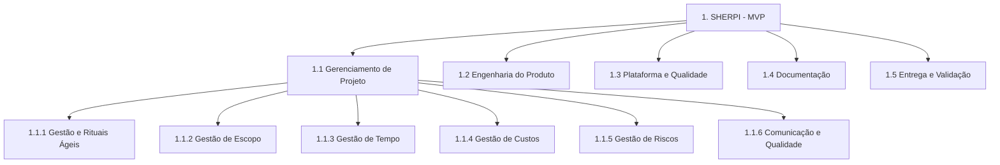

# Estrutura Analítica do Projeto (EAP / WBS) — SHERPI

Decomposição hierárquica de **todo o trabalho** do projeto. Conforme o Guia de Diretrizes, há uma
ramificação principal dedicada ao **Gerenciamento de Projeto**, com a **Gestão e Rituais Ágeis** como
sub-ramificação (`1.1 → 1.1.1`). Legenda: 🔵 entregue. Sprints 1–7 concluídas (backend completo; UI frontend das sprints 4–7 pendente). Ver [`roadmap.md`](roadmap.md) e [`backlog.md`](backlog.md).

## 1. SHERPI (MVP)

### 1.1 Gerenciamento de Projeto
- **1.1.1 Gestão e Rituais Ágeis** — Design Sprint semanal, Sprint Planning, Dailies, Sprint Review
  (sábados), Retrospective e refinamento de backlog.
- **1.1.2 Gestão de Escopo** — Backlog do Produto, Sprint Backlog, esta EAP, controle de mudanças.
- **1.1.3 Gestão de Tempo** — cronograma das sprints (S1–S7), marcos (M1–M7), acompanhamento.
- **1.1.4 Gestão de Custos** — *free tier* do LLM, infra local, guarda de tokens.
- **1.1.5 Gestão de Riscos** — registro e mitigação de riscos (ver [`pmp.md`](pmp.md) §5).
- **1.1.6 Comunicação e Qualidade** — canais, *Definition of Done*, gate de CI.

### 1.2 Engenharia do Produto
- **1.2.1 Integridade Documental (firewall)** 🔵 — detector + parser PyMuPDF.
- **1.2.2 Análise da Petição** 🔵 — extração estruturada (LLM) + checagem de admissibilidade.
- **1.2.3 Orquestração** 🔵 — use case `analyze_petition` (firewall → extração → admissibilidade).
- **1.2.4 Persistência** 🔵 — modelos SQLModel, repositórios, migrations.
- **1.2.5 Interface (UI mínima)** 🔵 — upload do PDF → laudo + resumo estruturado.
- **1.2.10 Multi-domínio (rito-aware) + Trabalhista** 🔵 (S3) — enum `Rito`, estratégias de
  admissibilidade por rito; `TrabalhistaStrategy` (CLT 840, pedido líquido). Ver ADR-0008.
- **1.2.7 Identidade & Acesso** 🔵 (S4) — login OAuth2/JWT (perfil único), rotas protegidas; UI pendente.
- **1.2.8 Revisão & Auditoria** 🔵 (S4) — *human-in-the-loop* + trilha append-only (CNJ 615/2025); UI pendente.
- **1.2.6 Classificação Taxonômica (TPU)** 🔵 (S5) — embeddings JurisBERT + k-NN (numpy/bytes, por ramo); UI pendente.
- **1.2.9 Integração Judicial** 🔵 (S7) — `SandboxSourceAdapter` + `IngestPetitions` + `IngestQueue`; ingestão assíncrona.
- **1.2.11 Domínios adicionais** *(pós-S3)* — previdenciário/INSS, execução fiscal, família/JEC.

### 1.3 Plataforma e Qualidade
- **1.3.1 Scaffold DDD/Hexagonal** 🔵 — estrutura de contextos, `shared_kernel`, ports.
- **1.3.2 CI/CD e Ferramentas** 🔵 (S1 / S6) — ruff, mypy, pytest, pre-commit, GitHub Actions; `pip-audit` gate ✅ S6.
- **1.3.3 Dados Sintéticos** 🔵 — gerador de petições rotuladas (synthetic-first).
- **1.3.4 Eval Harness** 🔵 — métricas (firewall, extração) e gate de CI.
- **1.3.5 Segurança & Observabilidade** 🔵 (S1 / S6) — segurança de upload; `structlog` + correlation IDs; `MappedRegexAnonymizer` + `PresidioAnonymizer` (NER, extra `ner`); Sentry; `Dockerfile` multi-stage.

### 1.4 Documentação
- **1.4.1 Produto** — PRD.
- **1.4.2 Técnica** — especificação técnica, ADRs, mapa de contextos DDD.
- **1.4.3 Processo** — este PGP, EAP, backlog e processo ágil.

### 1.5 Entrega e Validação
- **1.5.1 Sprint Reviews** — validações de sábado com o professor.
- **1.5.2 Demo do MVP** — fluxo ponta-a-ponta executável.
- **1.5.3 Encerramento** — empacotamento, relatório de métricas e defesa.

## Dicionário da EAP (resumo)

| Pacote | Entregável principal | Responsável |
|---|---|---|
| 1.1 | PGP, cronograma, riscos | GP |
| 1.1.1 | Rituais ágeis executados e registrados | Scrum Master |
| 1.2 | Software funcional do MVP | Arquiteto, Eng. de IA, Fullstack (2) |
| 1.3 | Plataforma testada e CI verde | DevOps/Segurança |
| 1.4 | Documentação aprovada | PO (produto) + time |
| 1.5 | MVP demonstrado e validado | Time |
